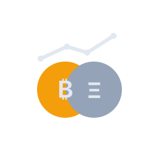
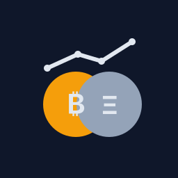

# 資産チェッカー (暗号資産 + 円資産)

ページを開くと、保存済みの保有数量に対して現在価格を取得し、円換算の評価額を表示するシンプルなWebアプリです。
`minitask` とは別アプリとして、この `btc-eth-portfolio` ディレクトリ単体で公開できます。

## 使い方

1. `btc-eth-portfolio/index.html` をブラウザで開く
2. BTC/ETH/USDT/USDC の保有数量、投資信託(円)、預金(円)、小規模企業共済(円)を入力
3. 必要なら総資産目標とカテゴリ別目標を入力
4. 必要なら好きな資産名・円金額・カテゴリを追加
5. `保有情報を保存` を押す
6. 以後はページを開くだけで最新価格を取得して評価額を表示

## 計算ルール

- BTC/ETH/USDT/USDC/USDJPY: Coinbase Exchange Rates API の公開レートを使用
- BTC/ETH は USD レートと USD/JPY から円換算
- USDT/USDC は USD レートを取得し、USD/JPY から円換算
- 投資信託/預金/小規模企業共済: 円で手入力した値をそのまま合算
- 任意のカスタム資産: 名前・円金額・カテゴリを追加して合算
- 追加したカスタム資産は後から編集・削除可能
- カテゴリ別目標: `現金 / 投資信託 / 暗号資産 / 共済 / 不動産 / その他` ごとに設定可能
- 固定資産は自動分類し、追加資産は選択カテゴリに集計
- 保有数量はブラウザの`localStorage`に保存
- 入金履歴を `日付 / 入金先 / 金額 / メモ` で記録可能
- 入金履歴は評価額と分離して保持し、`入金累計 / 今月入金 / 現在評価との差額` を表示
- 入金履歴とSVG読み込みは、初期状態では折りたたみ表示
- 円換算したBTC/ETH/USDT/USDC/投資信託/預金/小規模企業共済の内訳を円グラフで表示
- 目標総資産(円)を設定して達成率(%)を表示
- カテゴリ別目標に対する進捗率も表示
- 月次スナップショットを自動保存し、前月比を表示
- 月次スナップショットを元に、直近1年の総資産推移を折れ線グラフで表示
- 価格API取得に失敗した場合は、最終成功時の価格キャッシュを使って継続表示
- SVGファイルを読み込んでプレビュー表示（保存後は次回起動時に再表示）
- 5分ごとに自動更新（`価格を更新`ボタンでも手動更新可能）
- `manifest.webmanifest` と `sw.js` を含むPWA対応（ホーム画面追加・オフライン時のシェル表示）


## Repository Icon Assets

`assets/` にリポジトリ用アイコンを配置しています。

- `assets/icon.svg`（ベクター）
- `assets/icon-512.png`（透過）
- `assets/icon-256.png`（透過）
- `assets/icon-bg-512.png`（背景色 `#0F172A`）
- `assets/icon-bg-256.png`（背景色 `#0F172A`）
- PWA設定は `manifest.webmanifest` で `assets/icon-bg-192.png` / `assets/icon-bg-512.png` を参照

### 生成コマンド

```bash
npm install
npm run render:icons
```

### Preview

Transparent 256:



Navy background 256:


